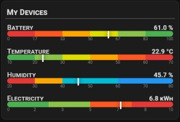
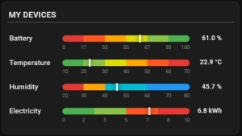
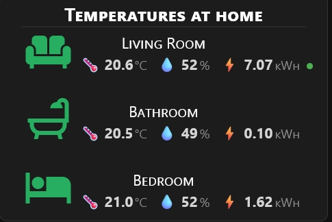
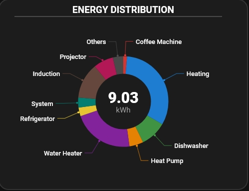
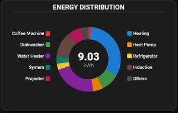

# Piotras Cards Pack

Collection of high-performance Home Assistant cards with advanced visual editors for Energy, Climate, and Data visualization.

## Cards included:

### 📊 Piotras Value Bar
Clean and modern progress bars for any numerical sensor.

 

<details>
<summary>🔍 <a href="#">More info (click to expand)</a></summary>
<br>
**3 layout modes:**
- **Standard** — device name on the left, bar in the middle, value on the right
- **Compact** — bar below the name, ideal for narrow columns
- **Value on bar** — value displayed directly inside the bar

**Key features:**
- Fully customizable color gradient (up to 13 colors per bar)
- Independent min/max range per device — perfect for mixing units (%, W, °C, kWh)
- Scale labels below each bar with adjustable precision
- Click any row to open the entity detail in Home Assistant
- SVG-based rendering — sharp on any screen resolution
- Responsive — adapts automatically to card width

**Visual Editor:** Full GUI editor — add devices, set color gradients,
adjust fonts and value colors without touching YAML.

👉 **[View the Full Guide Value Bar](https://github.com/Piotras1/piotras-cards-pack/discussions/3)**

</details>

---

### 🌡️ Piotras Climate Info
The ultimate monitoring hub for your home climate and energy usage.

 

<details>
<summary>🔍 <a href="#">More info (click to expand)</a></summary>
<br>

**3 layout modes:**
- **Standard** — name | icon | values in a single row
- **Reversed** — icon | name | values (great for icon-first dashboards)
- **Name on top** — name above, values centered below (compact rooms overview)

**Key features:**
- Temperature, humidity and energy (kWh) in one clean row per room
- **Per-device temperature color zones** — set your own Cold / Comfort / Hot
  thresholds and colors independently for each room
- **Multiple kWh sensors per room** — automatically summed into one total
- **Active indicator** — a glowing dot shows when a device is currently running
- **Per-device HA icon size** — scale each icon independently
- SVG-based rendering — pixel-perfect on any screen and resolution
- Responsive — automatically adapts to card width

**Visual Editor:** Full GUI editor — add devices, configure temperature
color zones with color pickers and range sliders, set icons, entities
and energy sensors without touching YAML.

</details>

---

### 🍩 Piotras Energy Donut

An interactive donut chart for energy distribution analysis — available in two layouts with full visual editor.

 

<details>
<summary>🔍 <a href="#">More info (click to expand)</a></summary>
<br>

**Two layouts:**
- **Layout 1** — donut with curved callout lines following the ring arc, automatic collision avoidance so labels never overlap
- **Layout 2** — donut with left/right legend, auto-centered relative to the chart

**Key features:**
- **Interactive Focus Mode** — click any segment or legend item to isolate it; selected device enlarges while others fade, showing kWh value and percentage in the chart center
- **Smart callout lines** — `show_lines: false` hides lines for a clean look; clicking any label reveals its line on demand
- **Configurable display limit** — show only the top N devices on the chart; the rest are automatically grouped into the "Others" segment. Set `limit: 4` to focus on the biggest consumers, or remove the limit to show everything
- **Auto-reset timer** — configurable timeout returns to overview automatically after a click
- **20-color custom palette** — every color individually adjustable
- **Fully responsive** — SVG scales cleanly to any card width with proportional ring thickness, radius and font sizes

**Visual Editor:** Full GUI — manage devices, tweak colors and dimensions without YAML.

## Advanced Features & Visual Gallery

This card supports more than just Energy! Check out our **pinned discussion** to see how to enable:
  **Battery & Percentage Mode** (using `na_procenty: true`)
  **Live Monitoring** for Watts (W) and Amperes (A)
  **Custom Units & Precision** (using `po_opisie` and `po_przecinku`)

👉 **[View the Full Guide Energy Donut](https://github.com/Piotras1/piotras-cards-pack/discussions/2)**

</details>

## ⚙️ Installation

### Method 1: Via HACS (Recommended)
1. Open HACS in Home Assistant.
2. Go to **Frontend**.
3. Click the three dots in the top right and select **Custom repositories**.
4. Add the following URL and select **Dashboard** as the category:
```
https://github.com/Piotras1/piotras-cards-pack
```
5. Click **Add**, find **Piotras Cards Pack** and click **Download**.
6. Hard reload your browser (Ctrl+Shift+R).

### Method 2: Manual Installation
1. Download this repository as a ZIP file and extract it.
2. Inside your Home Assistant `config/www/` directory, create a new folder named `piotras-cards`.
3. Copy all files from the `dist/` folder into `config/www/piotras-cards/`.
4. Go to **Settings → Dashboards → Resources**.
5. Click **Add Resource** and enter:
```
/local/piotras-cards/piotras-loader-cards.js?v=1.0.1
```
- Resource type: **JavaScript Module**
6. Hard reload your browser (Ctrl+Shift+R).

  
---
*Created by Piotras. Strictly engineered for reliability.*
